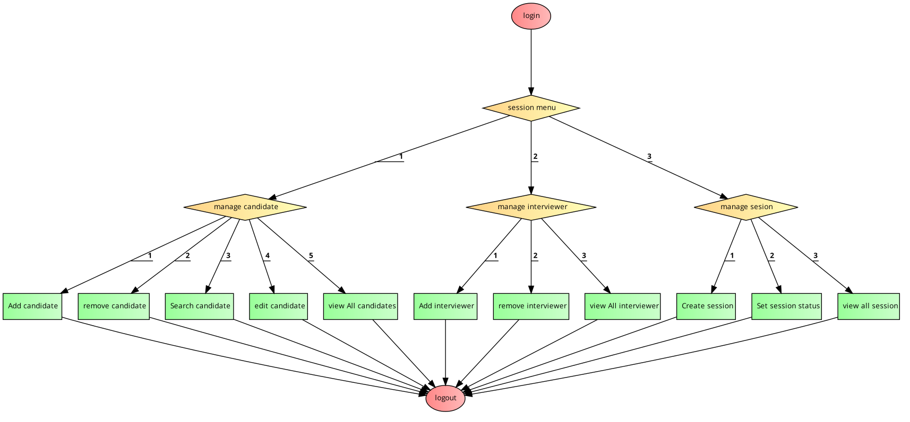

# Inteview Panel

Interview Panel is a console application I developed when I was learning OOP in Java.
It is currently at the first version of the application.
It has a user interface with some menus and functionalities, and it is integrated with JSON for the backend.
In future updates, I will connect a backend SQL server to it.
Currently it has one actor that is admin who entry data of candidates and interviewer.
 The admin can create session between interviewer and candidates and update their status. I future updatet will add a login for interviewer to update candiate performance.

## Menu Control flow

## Output Screenshot

